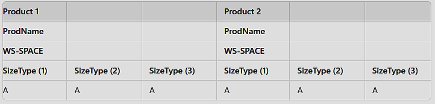

# IDENTIFICATION DIVISION.
# PROGRAM-ID.       ManualeDiCobol.
# AUTHOR.       Giulio.
# DATE-WRITTEN. 12/08/2024

# ENVIRONMENT DIVISION.
Dove si specificano i dettagli dell'ambiente in cui il programma viene eseguito. Include sezioni come CONFIGURATION SECTION e INPUT-OUTPUT SECTION.

# INPUT-OUTPUT SECTION.
divisa in FILE-CONTROL e I-O CONTROL (facoltativo)

# FILE-CONTROL.
si dichiarano i file utilizzati nel programma e si specificano le modalità di accesso.

# CONFIGURATION SECTION.
dichiara configurazioni specifiche del sistema, come le impostazioni per l'host e le periferiche

# SPECIAL-NAMES.
Viene utilizzata per dare nomi simbolici a specifici valori o per estendere il set di caratteri. eg. DECIMAL-POINT IS COMMA
Esempio:
```COBOL
CLASS Cond1 IS "A" THRU "C", "D".
```
Controlla che Cond1 sia "A","B","C" o "D".
Cond1 non è una variabile di per se, ma una condizione.
Per esempio può essere usata così nel PROCEDURE DIVISION:
```COBOL
IF Score IS PassingScore THEN [...]
```

# DATA DIVISION.
dove si definiscono tutte le variabili e le strutture dati

## FILE SECTION.
Dove si definiscono le strutture dei file che il programma andra' a leggere o scrivere

## WORKING-STORAGE SECTION.
Dove si dichiarano le variabili di lavoro, che sono variabili temporanee utilizzate durante l'elaborazione del programma.
I nomi devono essere univoci, MA possono essere uguali in gruppi differenti. 
Esempio: 
```COBOL
01 Num       PIC 9(2) VALUE 1.
```
Legenda del primo numero:
- 01-49: per descrivere variabili e strutture di dati.
- 66: per definire "renames" (alias) per altre variabili.
- 77: per definire variabili indipendenti, non strutturate.
- 88: per definire condizioni o valori booleani.

Il numero viene formattato con PIC. Legenda dei simboli in PIC:
- 9: Numerico
- X: AlfaNumerico
- Z: diventa uno spazio se 0
- V: virgola
- S: signed
- $: mostra il simbolo del dollaro, ma vicino alla cifra più a sinistra. 
      Se non c'è abbastanza spazio, scarta la cifra più a destra. Vedi ["CASTING"](./11.cob)

Nota1: Scrivere "9(2)" è uguale a scrivere "99".
Nota2. "Value" da un valore di default.

*Esempio1*: 
```COBOL
01 PIValue CONSTANT AS 3.14.
```
Crea una costante.

*Esempio2*: 
```COBOL
02 FILLER PIC X VALUE SPACE.
[...]
01 PageHeading.
           02 FILLER PIC X(13) VALUE "Costumer List".
```
Filler è un campo temporaneo o di riempimento all'interno di una struttura dati, come record o gruppi di dati, senza assegnare loro un nome. 

Esempio:
```COBOL
01 TestNumber    PIC X.
           88 IsPrime    VALUE "1", "3", "5", "7".
           88 IsOdd    VALUE "1", "3", "5", "7", "9".
           88 LessThan5    VALUE "1" THRU "4".    *> 1, 2, 3 e 4
```
Ci sono tre condizioni precaricate che si possono controllare nel PROCEDURE DIVISION per esempio con:
```COBOL
WHEN IsPrime DISPLAY "Primo"
```

## SCREEN SECTION 
Le screen section sono strutture usate per creare interfacce video di input-output.
```COBOL
   01 STUDENT-SCREEN.
      05 LINE 1 COLUMN 10 VALUE "Enter Student ID:".
      05 LINE 1 COLUMN 30 PIC 9(5) TO WS-STUDENT-ID.
      05 LINE 2 COLUMN 10 VALUE "Enter Student Name:".
      05 LINE 2 COLUMN 30 PIC X(20) TO WS-STUDENT-NAME.
```
Nell'esempio precedente, COLUMN e LINE dichiarano la posizione a schermo
Nella procedure division viene poi dichiarato:
```COBOL
   PROCEDURE DIVISION.
       MAIN-LOGIC.
           DISPLAY STUDENT-SCREEN.
           ACCEPT STUDENT-SCREEN.
```

Per esempio, 20.cob stampa a schermo:


# PROCEDURE DIVISION.
Indica il codice eseguibile del programma
- ```STOP RUN.``` - Termina il Main.
- ```DISPLAY "" Num1.``` - Mostra " "Num1.
  - ```DISPLAY "Valore iniziale: " Num NO ADVANCING.``` - NO ADVANCING non manda a capo.
- ```ACCEPT Num1.``` - prende Num1 in input.
- 
## Condizioni e Cicli
- ```IF VARIABILE = 1 THEN [...] ELSE IF [...] ELSE [...] END-IF.```  - esegue un ciclo if THEN ELSE.
  - ```IF Val1 IS Val2 THEN [...] END-IF. ```
  - ```IF Num1 LESS THAN Num2 THEN [...] END-IF. ```
  - ```IF Num1 > Num2 AND Num3 < Num4 THEN [...] END-IF. ```
  - ```IF Num1 > Num2 OR Num3 < Num4 THEN [...] END-IF. ```
- ```EVALUATE TRUE [...] WHEN Cond1 DISPLAY "Cond1" [...] WHEN OTHER [...] END-EVALUATE.``` - corrispettivo delle strutture IF, ELSE IF e ELSE.
- ```PERFORM n TIMES [...] END-PERFORM.``` - pari a un ciclo for. Ripete per n volte.
  - ```PERFORM UNTIL NOT Condition [...] END-PERFORM.``` - Ripete finché non viene violata la condizione
  - ```NOT AT END DISPLAY Val``` - nei cicli PERFORM si può mostrare un valore tranne che alla fine del ciclo.
## azioni con le variabili
- ```COMPUTE Risultato = Num1 ** Num2.``` - è utilizzato per eseguire operazioni aritmetiche e assegnare il risultato direttamente a una o più variabili.
  - ```COMPUTE Num ROUNDED = 3.0 + 2.005.``` - ROUNDED arrotonda in eccesso (eg. .71 divenda .8).
- ```MOVE Num1 TO Num2.``` - trasferisce il valore di una variabile a un'altra variabile.
  - ```MOVE ALL n``` - riempie di n.
  - ```MOVE ZERO``` - riempie di zero.
  - ```MOVE SPACE``` - riempie di spazi.
  - ```MOVE HIGH-VALUE``` - valore massimo possibile per il tipo di dati della variabile.
  - ```MOVE LOW-VALUE``` - valore minimo possibile per il tipo di dati della variabile.
  - ```MOVE QUOTE```
- ```SET indice TO valore``` - assegna un valore specifico a una variabile basata su una condizione.
  - ```SET indice UP BY 1``` - incrementa l'indice.
  - ```SET indice DOWN BY 1```
  - ```SET condition-name TO TRUE``` - attivare condition names (booleani).
  - ```SET condition-name TO FALSE```
- ```ADD Num1, Num2 GIVING Risultato.``` - esegue la somma.
- ```SUBTRACT Num1 FROM Num2 GIVING Risultato.```
- ```MULTIPLY Num1 BY Num2 GIVING Risultato.```
- ```DIVIDE Num1 BY Num2 GIVING Risultato REMAINDER Resto.```
- ```ACCEPT CURRENTDATE FROM DATE YYYYMMDD.``` - permette di ottenere la data attuale.
  - Il formato è il seguente:
  ```COBOL
         01 CurrentDate.
           02 CurrentYear       PIC 9(4).
           02 CurrentMonth       PIC 99.
           02 CurrentDay       PIC 99.
  ```
- ```ACCEPT CURRENTTIME FROM TIME.``` - permette di ottenere l'ora attuale.
  - Il formato è il seguente:
  ```COBOL
       01 CurrentTime.
           02 CurrentHour       PIC 99.
           02 CurrentMinute       PIC 99.
  ```
<Br><Br>

## Sottofunzioni
### Paragrafi (File [10.cob](./10.cob))
I paragrafi (o sottofunzioni) vengono definiti e chiamati così:
```COBOL
  PERFORM Routine1. *> esegue la Routine1 e poi prosegue al punto successivo precedente
  GO TO Routine1. *> esegue la Routine1 e poi prosegue all'interno di Routine1.

  Routine1.
    [...].
```

Alcuni esempi di chiamata PERFORM più avanzati:
 -  ```PERFORM Routine1 2 TIMES.```
 -  ```PERFORM Routine1 WITH TEST AFTER UNTIL Var > Num.```
 -  ```PERFORM Routine1 VARYING Var FROM 1 BY 1 UNTIL Var = Num.```

### Subroutines (File [9.cob](./9.cob))
Le sottoroutine devono essere compilate con questo comando
```BASH
cobc -m RoutineFile.cob
```

Le subroutines vengono così definite in un file separato:
*GETSUM.cob*:
```COBOL
PROGRAM-ID.       GETSUM.
[...]
LINKAGE SECTION.
          01 LNum1    PIC 9 VALUE 0.
          01 LNum2    PIC 9 VALUE 0.
          01 LSum    PIC 99.
PROCEDURE DIVISION USING LNum1, LNum2, LSum.
          COMPUTE LSum = LNum1 + LNum2.
```

E richiamate poi nel PROCEDURE DIVISION usando il nome del PROGRAM-ID:
*file.cob*:
```COBOL
PROCEDURE DIVISION.
           CALL 'GETSUM' USING Num1, Num2, Sum1.
           DISPLAY Num1 " + "  Num2 " = " Sum1.
```
<Br><Br>

## Casting (File [11.cob](./11.cob) e [17.cob](./17.cob))
Il casting è il processo di conversione di un valore da un tipo di dato a un altro.
In COBOL, se un numero è più grande della variabile di destinazione, l'elemento più a sinistra viene scartato.
Esempio: 
```COBOL
WORKING-STORAGE SECTION.
        *> numero a data
        01 BDay PIC 9(9) VALUE 912211974.
        01 ADate PIC 99/99/9999.
        *> numero a dollaro
        01 FLNum PIC 9999V99 VALUE 3579.00.
        01 DollarNum PIC $$,$$9.99.
PROCEDURE DIVISION.
        MOVE BDay TO ADate.
        MOVE FlNum TO DollarNum
```

```BASH
12/21/1974
$3,579.00
```

<Br>Un'altro metodo di onversione usando solo ```WORKING-STORAGE SECTION```.
```COBOL
01 ChangeMe.
        02 TextNum PIC X(6).
        02 FloatNum REDEFINES TextNum PIC 9(4)V99.
```

<Br>Combinando UNSTRING e REDEFINES:
```COBOL
01 SplitNum.
        02 WNum PIC 9(4) VALUE ZERO.
        02 FNum PIC 99 VALUE ZERO.
01 FLNum REDEFINES SplitNum PIC 9999V99.
PROCEDURE DIVISION.
        UNSTRING StrNum
            DELIMITED BY "." OR SPACES INTO WNum, FNum
```
<Br><Br>

## Operazioni con le stringhe [(File 12.cob)](./12.cob)
- ```INSPECT Str1 TALLYING Res FOR CHARACTERS``` - vengono contati tutti i caratteri presenti in Str1, inclusi gli spazi.
  - ```INSPECT Str1 TALLYING Res FOR ALL char1``` - vengono contati tutti i char1 presenti in Str1.
    - ```INSPECT Str1 TALLYING Res FOR ALL ' '``` - vengono contati tutti gli spazi presenti in Str1.
- ```MOVE FUNCTION UPPER-CASE(SampStr) TO UpperStr.``` - converte in maiuscolo.
  - ```MOVE FUNCTION LOWER-CASE(SampStr) TO UpperStr.``` - converte in minuscolo.

### Il comando STRING e UNSTRING
Il comando STRING permette di concatenare due o più stringhe, il cui limite deve essere dichiarato con ```DELIMITED BY```.
```COBOL
STRING Nome DELIMITED BY SIZE   *> fino a dove dovrà fermarsi
               SPACE            *> aggiunge uno spazio tra Nome e Cognome    
               Cognome DELIMITED BY SIZE
               INTO Persona
               ON OVERFLOW 
                    DISPLAY 'Overflowed'.
```

<br> Unstring invece suddivide una stringa in più variabili utilizzando un delimitatore ```Delim```.
```COBOL
UNSTRING Frase DELIMITED BY Delim OR SPACES
        INTO Nome
        Cognome
        Titolo.
```

```ON OVERFLOW```, se il risultato della concatenazione supera la lunghezza del campo, esegue l'azione seguente.

Tipi di DELIMITED:
 - ```DELIMITED BY SIZE``` - La stringa viene considerata interamente.
 - ```DELIMITED BY SPACE``` - considerata fino al primo spazio (o serie di spazi consecutivi con SPACES).
 - ```DELIMITED BY ALL char``` - considerata fino al primo carattere specificato, ma se appare consecutivamente più volte, viene considerata l'intera sequenza.
 - ```DELIMITED BY char``` - delimitato da una stringa letterale, un carattere o una variabile.

Il puntatore (```WITH POINTER Ptr```) è una variabile numerica che tiene traccia della posizione corrente all'interno della stringa di destinazione. 
Parte dal valore dichiarato e, dopo ogni esecuzione, viene aggiornato alla nuova posizione.
```COBOL
STRING SSTR1 DELIMITED BY SIZE SPACE
           SSTR2 DELIMITED BY "#" INTO DEST WITH POINTER Ptr. 
```
<Br><Br>

## Tabelle [(File 16.cob)](./16.cob)
Una tabella viene definita così:
```COBOL
01 OrderTable.
      02 Product OCCURS 3 TIMES INDEXED BY I.
          03 ProdName PIC X(10).
          03 WS-SPACE PIC X(1) VALUE ' '.
          03 ProdSize OCCURS 3 TIMES INDEXED BY J.
              04 SizeType PIC A.
```


```INDEXED BY I.``` è un indice dei dati che viene gestito internamente dal compilatore e non può essere manipolato dall'utente
Può essere manipolato con:
SET, SEARCH, o PERFORM VARYING.

Per aggiungere valori:
```COBOL
SET I J TO 1. *> Inizializza le variabili I e J a 1
MOVE 'Blue Shirt' TO Product(I). *> Product(1)
MOVE 'S' TO ProdSize(I,J). *> ProdSize(riga,colonna) (1,1)
SET J UP BY 1.
MOVE 'M' TO ProdSize(I,J). *> (1,2)
MOVE 'Blue Shirt SMLRed Shirt S  Blank Shirt S' TO 
ORDERTABLE. *> sovrascrive "Blue Shirt SM "
MOVE 'Grey Shirt S' TO Product(3).
```

Per mostrare la tabella e i campi:
- ```DISPLAY OrderTable.``` mostra tutti i campi su un'unica riga. Ogni campo viene stampato. Tra un valore e l'altro non c'è uno spazio.
- ```DISPLAY "Product " I ": " Product(I).``` - mostra l'elemento I nella sua interezza.

Per mostrare tutti gli elementi collegati a quel campo:
```COBOL
PERFORM GetSizes VARYING J FROM 1 BY 1 UNTIL J>3.
DISPLAY "Size " I ": " Product(I,J).
```
<Br>Per cercare un elemento:
```COBOL
SET I TO 1. *> indica il punto di partenza
SEARCH PRODUCT *> FORMALITA' per iniziare una ricerca
    AT END DISPLAY 'Product Not Found'
    WHEN ProdName(I) = 'Blue Shirt'
        DISPLAY 'Blue Shirt Found' *> ProdSize è solo un indice.
        PERFORM GetSizes
    END-SEARCH.
```
<br>

### Conversione di dati in tabella
```COBOL
01 ProdTable.
    02 ProdData.
        03 FILLER PIC X(9) VALUE "Red   SML".
        03 FILLER PIC X(9) VALUE "Blue  SML".
        03 FILLER PIC X(9) VALUE "Green SML".
    02 FILLER REDEFINES ProdData.
        03 Shirt OCCURS 3 TIMES.
            04 ProdName PIC X(6).
            04 ProdSizes PIC A OCCURS 3 TIMES.
```

<Br><Br>

## Lettura dei files [(File 13.cob)](./13.cob)
### In FILE-CONTROL
La lettura dei files da importare nel proprio codice cobol, avviene in **INPUT-OUTPUT SECTION**, nello specifico in FILE-CONTROL.

*Esempio*:
```COBOL
INPUT-OUTPUT SECTION.
FILE-CONTROL.
           SELECT CostumerFIle1 ASSIGN TO "File.dat"
               ORGANIZATION IS LINE SEQUENTIAL
               ACCESS IS SEQUENTIAL.
           SELECT CustomerFIle2 ASSIGN TO "File2.txt"
               ORGANIZATION IS INDEXED
               ACCESS MODE IS RANDOM
               RECORD KEY IS IDNum.
```
*Nota1: VA RIMOSSO: CONFIGURATION SECTION, SPECIAL-NAMES.*

**```SELECT```** associa un nome logico (CostumerFIle) al file fisico nel sistema.

**```ORGANIZATION```** definisce la struttura interna del file (come i record sono memorizzati e indicizzati):
 - ```ORGANIZATION IS LINE SEQUENTIAL``` - Ogni record è memorizzato su una singola linea e il file viene letto o scritto una linea alla volta.
 - ```ORGANIZATION IS INDEXED``` - i record nel file possono essere acceduti tramite una chiave (indice).

**```ACCESS```** definisce il metodo di accesso ai record nel file (come i record vengono letti o scritti dal programma):
 - ```ACCESS IS SEQUENTIAL``` - Di **Default**, i record sono letti o **scritti** uno dopo l'altro nell'ordine in cui appaiono nel file.
 - ```ACCESS MODE IS RANDOM``` - Il programma può accedere a qualsiasi record direttamente utilizzando una chiave di ricerca. Usato solitamente con file organizzati ```INDEXED```.
 - ```ACCESS MODE IS DYNAMIC``` - alterna tra SEQUENTIAL e RANDOM.
 - ```RECORD KEY IS IDNum``` - specifica che la chiave di ricerca.

### In PROCEDURE DIVISION
Il comando OPEN permette di aprire un file in diverse modalità:
 - ```OPEN OUTPUT File``` - se il file esiste già, viene sovrascritto.
 - ```OPEN EXTEND File``` - nuovi dati verranno aggiunti alla fine. Se il file non esiste, lo crea.
   - ```WRITE Data END-WRITE.``` - crive i dati del record corrente. Il comando END-WRITE segna la fine dell'operazione di scrittura.
     - ```WRITE FSFile FROM WSData AFTER ADVANCING PAGE``` - Crea una nuova pagina e scrive WSData in FSFile.
     - ```AFTER FSFile FROM WSData ADVANCING 5 LINES``` - Avanza di 5 linee e scrive WSData.
 - ```OPEN INPUT File``` - solo lettura.
   - ```READ File INTO Data [...] END-READ``` - crive i dati del record corrente.
 - ```OPEN I-O File.``` permette sia di leggere sia di scrivere sul file (che deve già esistere)
   - ```WRITE FSData INVALID KEY DISPLAY "ID Taken"```
   - ```DELETE File INVALID KEY DISPLAY "ERROR" END-DELETE.```
   - ```REWRITE Data INVALID KEY DISPLAY "ERROR" END-REWRITE.``` - solo in modalità I-O. Sovrascrive l'ultimo record letto.
   - ```READ File INVALID KEY DISPLAY "ERROR" END-READ.```
 - ```CLOSE File.``` - procede alla chiusura del file e a terminare il comando OPEN. 

*Esempio di lettura dati con OPEN INPUT*:
```COBOL
OPEN INPUT File.
    PERFORM UNTIL WSEOF='End'
        READ File INTO Data
            AT END MOVE 'End' TO WSEOF *>
            NOT AT END DISPLAY Data
        END-READ
    END-PERFORM
CLOSE File.
```

Il ciclo quindi ripete ciclicamente il file READ finché non si giunge alla fine

### in FILE SECTION.
La FILE SECTION in COBOL è una parte della **DATA DIVISION** che viene utilizzata per definire la struttura dei file che il programma dovrà gestire. In questa sezione si descrive il layout dei record dei file.
*Esempio*:
```COBOL
DATA DIVISION.
FILE SECTION.
FD CostumerFile.
01 CostumerData.
  02 Name PIC X(15).
  02 LastName PIC X(15).
```
*Nota:* I nomi in FILE SECTION devono essere diversi WORKING-STORAGE SECTION.
Dichiarazioni dei file:
 - ```FD File``` - viene utilizzata per descrivere i file che verranno letti, scritti o aggiornati durante l'esecuzione di un programma COBOL.
 - ```SD File``` - file temporanei durante un'operazione di ordinamento (SORT) o di fusione (MERGE) in COBOL.

```COBOL
FD CostumerFile.
01 CostumerData.
  [...]
  88 WSEOF VALUE HIGH-VALUE.
```
<br>

### in PROCEDURE DIVISION [(File14.cob)](./14.cob)
L'esercizio seguente [(File14.cob)](./14.cob) scrive con WRITE l'inizio di una pagina nel file.
```COBOL
FILE SECTION.
  FD CostumerReport.
        01 PrintLine PIC X(44).
WORKING-STORAGE SECTION.
  01 PageHeading.
            02 FILLER PIC X(13) VALUE "Costumer List".
  01 LineCount PIC 99 VALUE ZERO.
            88 NewPageRequired VALUE 40 THRU 99.

PROCEDURE DIVISION.
  WRITE PrintLine FROM PageHeading AFTER ADVANCING PAGE.
  WRITE PrintLine FROM Heads AFTER ADVANCING 5 LINES.
  MOVE 3 TO LineCount.
  IF NewPageRequired 
    ADD 1 TO PageCount. *> è superata la pagina, aggiunge 1 a PageCount
```
Il seguente codice esegue la scrittura dei dati ```CostumerDetailLine``` un campo alla volta fino a ```WSEOF```.
```COBOL
PERFORM PrintReportBody UNTIL WSEOF
PrintReportBody.
  WRITE PrintLine FROM CostumerDetailLine AFTER ADVANCING 1 LINE
  ADD 1 TO LineCount.
```

## SORT e MERGE su un file (File [18.cob](./18.cob))
```COBOL
FILE-CONTROL.
        SELECT WorkFile ASSIGN TO 'work.tmp'.
        SELECT OrgFile ASSIGN TO '18student.dat'
               ORGANIZATION IS LINE SEQUENTIAL.
        SELECT SortedFile ASSIGN TO '18student2.dat'
               ORGANIZATION IS LINE SEQUENTIAL.
FILE SECTION.
        FD OrgFile. [...]
        SD WorkFile. [...]
        FD SortedFile.
          01 SStudData.
            02 SSIDNum PIC 9. [...]
PROCEDURE DIVISION.
    SORT WorkFile ON ASCENDING KEY SSIdNum
        USING OrgFile
        GIVING SortedFile.
```

# DB2
## Dichiarare variabili e includere tabelle (File [19.cob](./19.cob))
```COBOL
   DATA DIVISION.
   WORKING-STORAGE SECTION.
   
   EXEC SQL
   INCLUDE table-name
   END-EXEC.

   EXEC SQL BEGIN DECLARE SECTION
   END-EXEC.
   
   01 STUDENT-REC.
      05 STUDENT-ID PIC 9(4).
      05 STUDENT-NAME PIC X(25).
      05 STUDENT-ADDRESS X(50).
   EXEC SQL END DECLARE SECTION
   END-EXEC.
```

## Controllo degli errori
SQLCA Indica al programma se un'esecuzione è andata a buon fine.
```COBOL
  WORKING-STORAGE SECTION.
      EXEC SQL
          INCLUDE SQLCA
      END-EXEC.
      [...]
  PROCEDURE DIVISION.
      IF SQLCODE = 0 
          DISPLAY 'Success'
      ELSE DISPLAY 'Error'
      END-IF.
```

## Select
```COBOL
   EXEC SQL
      SELECT STUDENT-ID, STUDENT-NAME, STUDENT-ADDRESS
      INTO :WS-STUDENT-ID, :WS-STUDENT-NAME, WS-STUDENT-ADDRESS FROM STUDENT
      WHERE STUDENT-ID=1004
   END-EXEC.
```

## Insert
```COBOL
   MOVE 1005 TO WS-STUDENT-ID.
   MOVE 'TutorialsPoint' TO WS-STUDENT-NAME.
   MOVE 'Hyderabad' TO WS-STUDENT-ADDRESS.
   EXEC SQL
      INSERT INTO STUDENT(STUDENT-ID, STUDENT-NAME, STUDENT-ADDRESS)
      VALUES (:WS-STUDENT-ID, :WS-STUDENT-NAME, WS-STUDENT-ADDRESS)
```

## Update
```COBOL
      UPDATE STUDENT SET STUDENT-ADDRESS=:WS-STUDENT-ADDRESS
      WHERE STUDENT-ID = 1003
```

## Delete
```COBOL
   MOVE 1005 TO WS-STUDENT-ID.
   EXEC SQL
      DELETE FROM STUDENT
      WHERE STUDENT-ID=:WS-STUDENT-ID
```

## Cursore
Un cursore è uno strumento che permette di recuperare e gestire righe multiple restituite da una query SQL, consentendo di elaborarle in modo sequenziale.

Open prepara il SELECT per l'esecuzione e close rilascia la memoria occupata dal cursore. 
```COBOL
   EXEC SQL
      OPEN STUDCUR
      [...]
      CLOSE STUDCUR
   END-EXEC.
```

Esempio di codice che dichiara un cursore che seleziona gli studenti con STUDENT-ID maggiore di 1001 e scorre i risultati uno alla volta, visualizzando i dati di ogni studente fino a quando non sono esauriti (indicati da SQLCODE = 100):
```COBOL
   WORKING-STORAGE SECTION.
      EXEC SQL
         DECLARE STUDCUR CURSOR FOR
         SELECT STUDENT-ID, STUDENT-NAME, STUDENT-ADDRESS FROM STUDENT
         WHERE STUDENT-ID >:WS-STUDENT-ID
      END-EXEC.
   PROCEDURE DIVISION.
      MOVE 1001 TO WS-STUDENT-ID.
      PERFORM UNTIL SQLCODE = 100
          EXEC SQL
              FETCH STUDCUR
              INTO :WS-STUDENT-ID, :WS-STUDENT-NAME, WS-STUDENT-ADDRESS
          END-EXEC
          DISPLAY WS-STUDENT-REC
      END-PERFORM
```